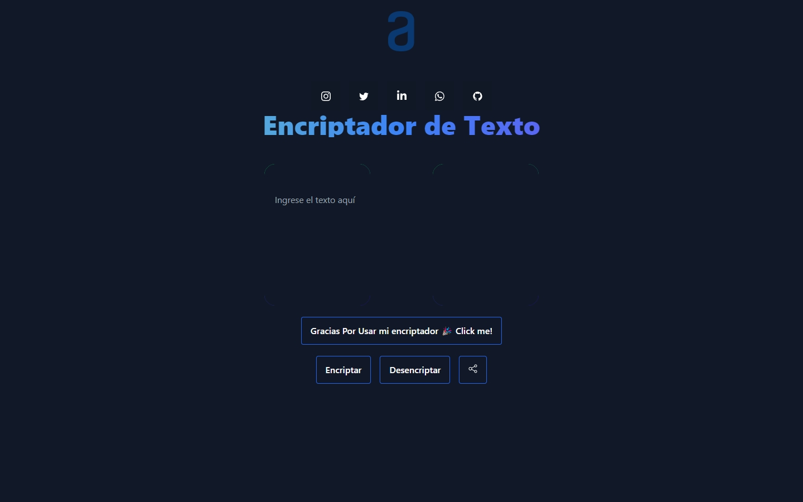

# Encriptador-Texto
Este proyecto consiste en un encriptador de texto web que permite a los usuarios encriptar y desencriptar texto de forma sencilla y segura. Utiliza el estándar de encriptación base64 para codificar y decodificar el texto ingresado por el usuario.

## Tabla de contenidos
- [Encriptador-Texto](#encriptador-texto)
  - [Tabla de contenidos](#tabla-de-contenidos)
  - [Descripción](#descripción)
  - [Uso](#uso)
  - [Características](#características)
  - [Tecnologías Utilizadas](#tecnologías-utilizadas)
  - [Contribución](#contribución)
  - [Licencia](#licencia)

## Descripción
El Encriptador de Texto es una aplicación web diseñada para proporcionar a los usuarios una forma rápida y conveniente de encriptar y desencriptar texto. Utiliza la codificación base64, un estándar ampliamente aceptado para la representación segura de datos binarios en texto ASCII.

## Uso
Ingrese el texto que desea encriptar en el campo provisto.
Haga clic en el botón "Encriptar" para codificar el texto.
Para desencriptar, ingrese el texto encriptado en el campo de salida.
Haga clic en el botón "Desencriptar" para recuperar el texto original.
También puede copiar el texto encriptado haciendo clic en el botón de copia.

## Características
- Interfaz de usuario intuitiva y fácil de usar.
- Encriptación y desencriptación rápida utilizando base64.
- Capacidad para copiar el texto encriptado al portapapeles.
- Animaciones visuales para una experiencia de usuario agradable.

## Tecnologías Utilizadas
- HTML
- CSS (Tailwind)
- JavaScript

## Contribución
¡Las contribuciones son bienvenidas! Si desea contribuir a este proyecto, por favor abra un problema para discutir los cambios propuestos o envíe una solicitud de extracción.

## Licencia
Este proyecto está bajo la Licencia MIT.

